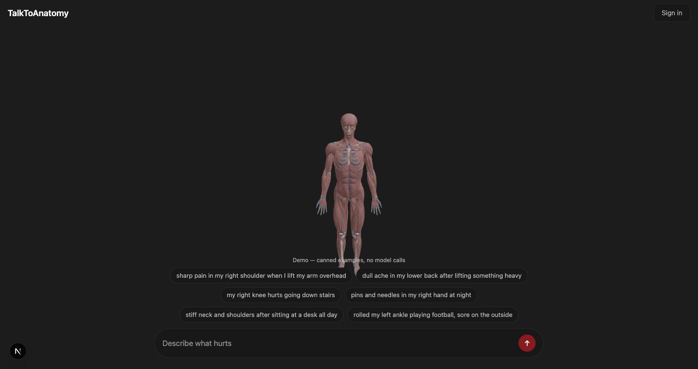
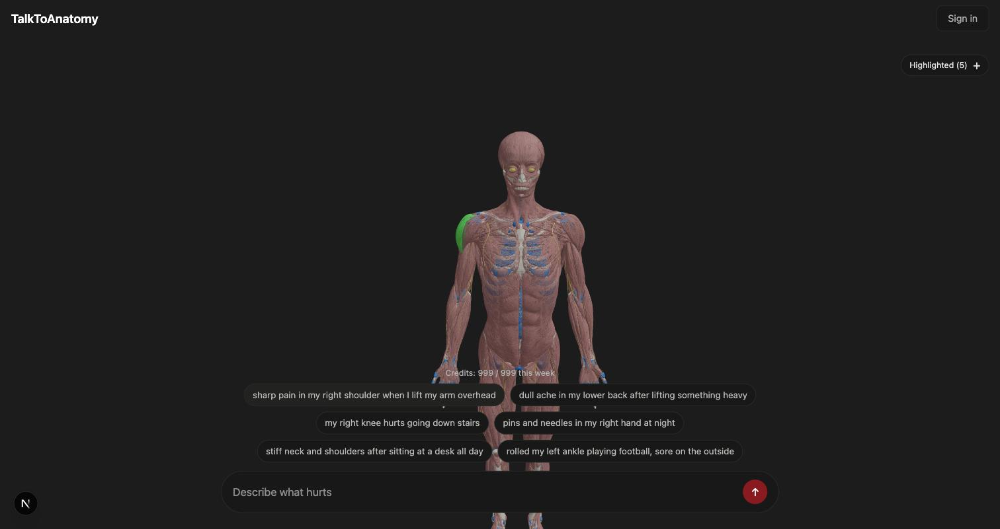
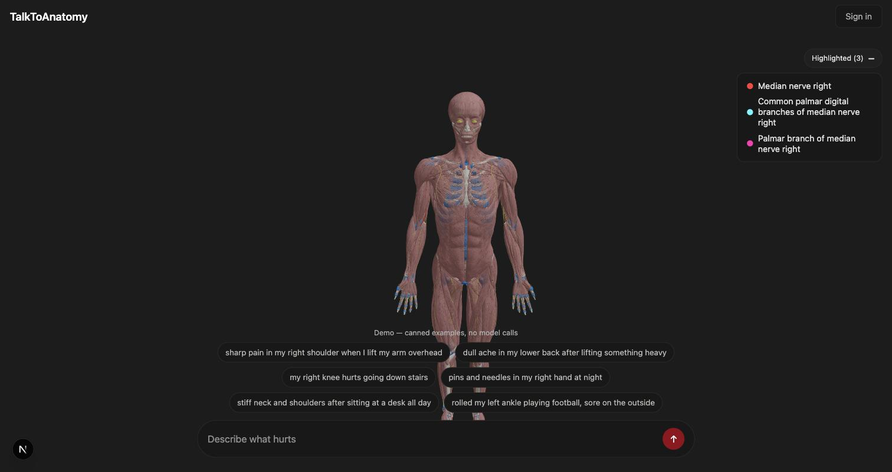

# TalkToAnatomy

**Describe what hurts in plain language. See it on the body.**

Type *"pins and needles in my right hand at night"* and the median nerve lights up on a 3D
anatomical model — primary structure first, plausible alternatives alongside it.

🔗 **[talktoanatomy.com](https://talktoanatomy.com)** · ⚠️ see [Status](#status)



---

## What it does

Anatomy search normally requires you to already know the answer: you cannot look up *supraspinatus*
if the word you have is *"my shoulder hurts when I reach up."* This closes that gap — ordinary
language in, a specific named structure out, shown in place.

| | |
|---|---|
|  |  |
| *"sharp pain in my right shoulder when I lift my arm overhead"* → supraspinatus, with the subacromial bursa and rotator cuff as alternatives | *"pins and needles in my right hand at night"* → median nerve and its palmar branches |

---

## How a query works

**1. Reasoning.** The description goes to a model under a tight prompt: return **strict JSON** with
one *leaf* anatomical structure, a side, and up to five supporting structures. Group terms — "rotator
cuff", "hip flexors" — are forbidden; it has to name a specific muscle, tendon, ligament, joint,
bone or nerve.

**2. Embedding.** Those labels are embedded and matched against **1,924 anatomical structures**
whose embeddings are precomputed. The matrix is `float32` and L2-normalised up front, so a lookup is
one matrix multiply rather than 1,924 distance calculations.

```python
all_embs = np.asarray([s["embedding"] for s in STRUCTURES], dtype=np.float32)
all_embs /= np.linalg.norm(all_embs, axis=1, keepdims=True)

# drop the Python lists once the matrix exists — they are the difference
# between fitting in a 512 MB instance and not
for s in STRUCTURES:
    s.pop("embedding", None)
```

**3. Hybrid matching.** Cosine similarity alone confuses anatomical neighbours, so the winner is
re-ranked with lexical signal — token overlap and fuzzy string distance — before laterality is
enforced. A left-sided complaint can never resolve to a right-sided structure.

**4. Caching, with a confidence floor.** Resolved mappings are cached in Redis, but only above a
similarity threshold (0.75 primary, 0.60 supporting) — a bad match should not be remembered forever.
Model responses are cached separately on the normalised text, so the same complaint never costs
twice.

**5. Highlighting.** Structure ids map to mesh names in four Draco-compressed GLTF models —
skeleton, muscles, joints, nerves — loaded from a CDN and highlighted in the browser.

---

## Demo mode

```bash
cd frontend
echo "NEXT_PUBLIC_DEMO=1" >> .env.local
npm install && npm run dev
```

`src/demo/` answers every API call from fixtures: six worked examples, real structure ids taken from
the production dataset, no backend, no database, **no model calls**. The 3D viewer and the
highlighting are the real thing — only the prediction is canned.

`src/demo/structures.index.json` is the full list of all 1,924 structures with embeddings stripped —
160 KB instead of 168 MB, which is enough to explore the anatomy set without the model file.

---

## Running it properly

Needs an OpenAI key, a Supabase project, an Upstash Redis database, and `structures.json` on a
public bucket. Copy `.env.example` into `backend/.env` and `frontend/.env.local`.

```bash
cd backend  && pip install -r requirements.txt && uvicorn backend.main:app --reload
cd frontend && npm install && npm run dev
```

**Cost control matters here.** The reasoning step is the only expensive call in the request path:

| `REASONING_MODEL` | per 1M in/out |
|---|---|
| `gpt-5.1` | $1.25 / $10.00 |
| `gpt-5.6-luna` *(default)* | $0.20 / $1.20 |
| `gpt-5-nano` | $0.05 / $0.40 |

---

## Stack

**Backend** — FastAPI · NumPy · OpenAI · Upstash Redis · Supabase · Stripe
**Frontend** — Next.js · React Three Fiber · drei · Three.js · Tailwind
**Data** — 1,924 anatomical structures, embedded; four Draco-compressed GLTF models

Also in here: device-scoped rate limiting that survives sign-up (anonymous usage is merged into the
user's account rather than reset), a weekly credit window, and Stripe subscriptions for unlimited
access.

---

## Status

The frontend and the 3D assets are live. **The backend is not** — it ran on a free tier alongside a
Supabase project that has since been deleted, and the service now fails at boot when it tries to
fetch the auth JWKS from a host that no longer resolves.

*Lesson kept deliberately: that fetch happens at **import time**, so one dead dependency takes down
every route, including the ones that never needed it.*

**Demo mode exists because of that** — the interesting part of this project is the retrieval and the
viewer, and neither should require a database to be alive.
